# Systems Manager Change Calendar replace the XXX Enterprise Calendar Solution.

The demonstration of AWS System Manager with Change Calendar to manage the "holiday" event. if your batch application depends on the enterprise calendar, please keep reading the instratuion. 

First of all, we will have the Capital One Enterprise Calendar which inlcudes all the holidays. there is no limiation for the downstream service to get the Systems Manager Change Calendar state. 
>note: if you are using different AWS Account, across AWS Account or create a new enterprise holiday calendar are needed. 

The XXX Team is able to privode you the holiday josn foramat to easiler for you to input, also, you are able to create your own calendars.

-------

From this demo, I will proivde two options to you to choose:
1. **Get Change Calendar State in Lambda Code**. you are your own EventBridge rule, like runs daily, your batch task need to check the enterprise calendar (code changes is required), if today is holiday, the batch job is suppsoed to stop running. 

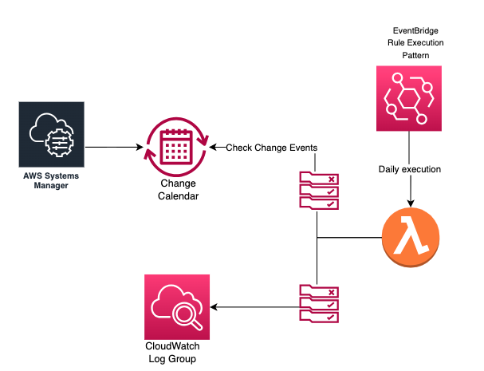

2. **Change Calender Triggers EventBridge to invoke downstream Lambda**, Leveraging the EventBridge rule to disable/enable your rules, there is no code changes.

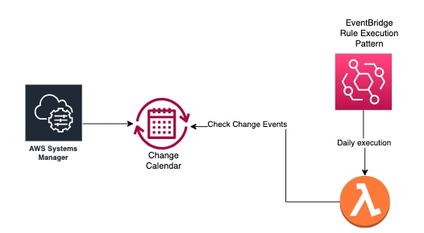

no matter which way you'd like to choose, let's steps on the Change Calendar Creation.

# Get Change Calendar State in Lambda Code 

## Let's Follow Below Steps to Archieve Solution.

1. Create a Permission Policy(**example named as:LambdaForCreateLogGroupAndChangeCalendarStatePolicy**) for lambda.
    1. Go to Identity and Access Management (IAM).
    2. Select "Policies" under Access management on the left navigator. 
    3. Click "Create policy"
    4. Choose JSON in Policy editor and copy & paste below JSON 
    ```json
        {
        "Version": "2012-10-17",
        "Statement": [
            {
                "Effect": "Allow",
                "Action": "logs:CreateLogGroup",
                "Resource": "arn:aws:logs:us-east-1:change_to_your_aws_account_id:*"
            },
            {
                "Effect": "Allow",
                "Action": [
                    "logs:CreateLogStream",
                    "logs:PutLogEvents"
                ],
                "Resource": [
                    "arn:aws:logs:us-east-1:change_to_your_aws_account_id:log-group:/aws/lambda/DailyLambdaFuncInovkedByCheckingChangeCalendarState:*"
                ]
            },
            {
                "Effect": "Allow",
                "Action": "ssm:GetCalendarState",
                "Resource": "arn:aws:ssm:us-east-1:change_to_your_aws_account_id:document/Holiday_Calendar"
            }
        ]
    }
    ```
    5. Click Next. and fill out the fields following below sreenshot as example. and then Create the policy.
    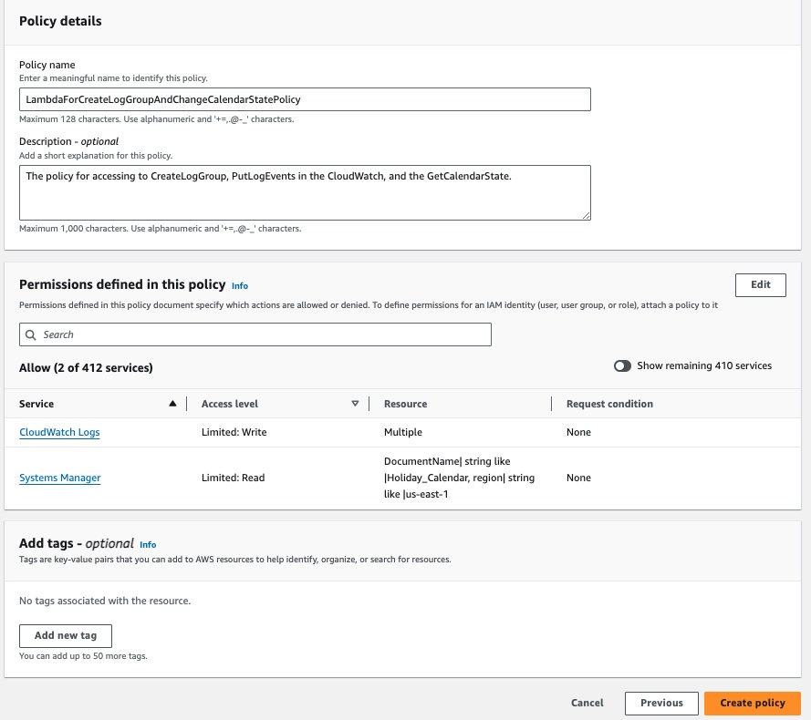

2. Create a Role(**example named as: LambdaBasicExecutionRole**) for lambda function.
    >(Note, you should use gearfile to create the role, This documentation just for instruction of integration with Change Calendar).

    1. Go to Identity and Access Management (IAM).
    2. Select "Roles" under Access management on the left navigator. 
    3. Click "Create role".
    4. Choose "AWS Service" and and select **Lambda** under the Use case for the trusted entity, click "Next".
    5. Search and select `LambdaForCreateLogGroupAndChangeCalendarStatePolicy` in the Add permissions page, and "Next".
    6. fill the name such as: **LambdaBasicExecutionRole**, click "Create role" after finished the review.

    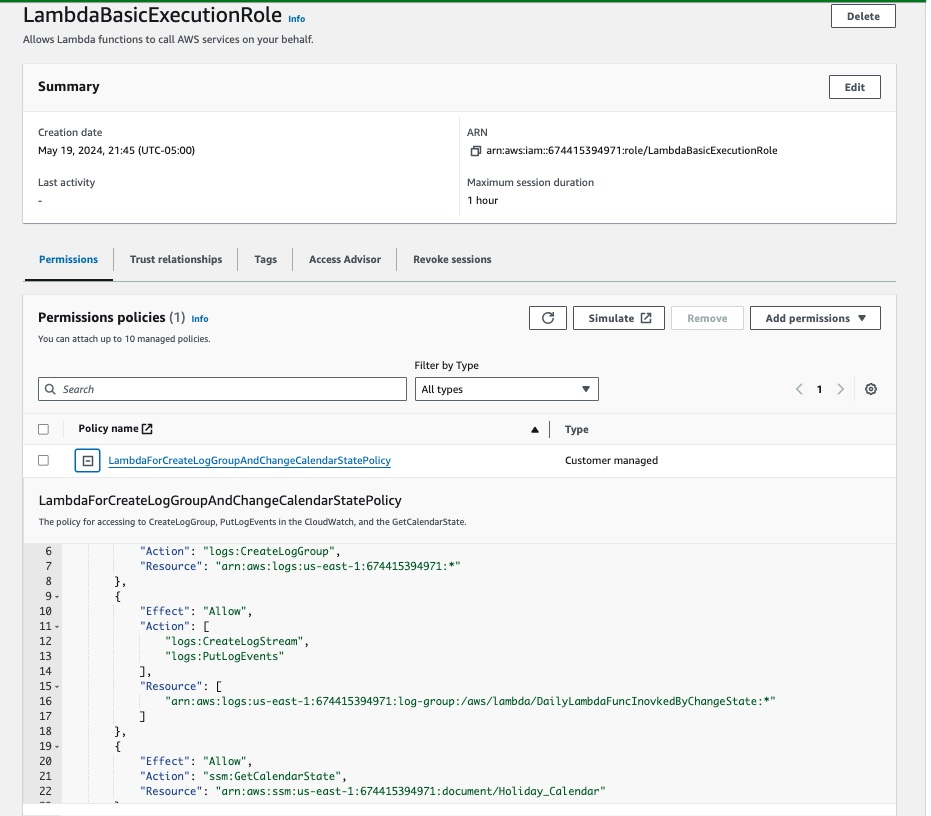
3. Create a Lambda function(**example named as: DailyLambdaFunctionCheckChangeCalendarState**)
>(Note, you should use gearfile to create the Lambda, This documentation just for instruction of integration with Change Calendar).
    1. Go to AWS Lambda, and click "Create function".
    2. Choose "Author from scratch", name the function name such as: **DailyLambdaFunctionCheckChangeCalendarState**, Python3.10 is the example runtime language, search the execution role by keyword: **LambdaBasicExecutionRole** detail following below screenshot, and then hit "Create function".
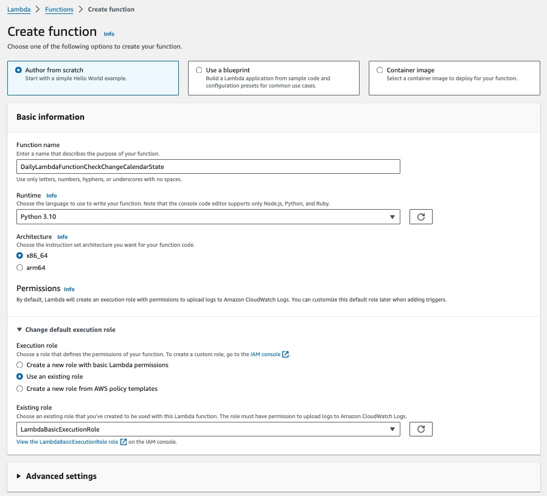

4. Update the code source.
There is the code snippet how to get the Change Calendar State, copy & paste to **DailyLambdaFunctionCheckChangeCalendarState**, and hit "Deploy"
```python
import json
import boto3
import datetime

def lambda_handler(event, context):
    # The Change Calendar Name created on the Systems Manager
    calendar_name = "Holiday_Calendar"
    # Log the event received from EventBridge
    print("Received event: " + json.dumps(event, indent=2))

    ssm = boto3.client('ssm')
    now = datetime.datetime.utcnow().strftime("%Y-%m-%dT%H:%M:%SZ")
    response = ssm.get_calendar_state(
        CalendarNames = [calendar_name], # its able to get muliple calendar states.
        AtTime=now)
        
    print("Checking the ssm calender status:" + json.dumps(response, indent=2))

    if response['State'] == 'OPEN':
        print ("Executing daily task by getting calendar states")
    else:
        print ("Holiday, task not executed  by getting calendar states")
    return {
        "statusCode": 200,
        "body": "Task status logged"
    }
```

5. Create CloudWatch EventBridge Rule which runs daily (**example named as: EventBridgeRuleRunsDaily**).
    1. Go to Amazon EventBridge and select "Rules" on the left navigator.
    2. Click "Create rule", and check the detail in below screenshot
    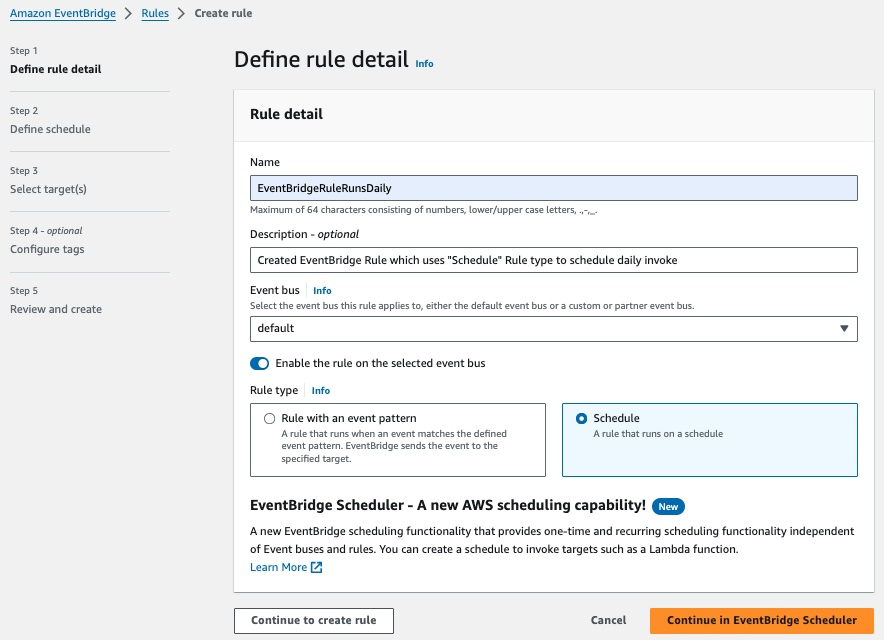
    <br/>
    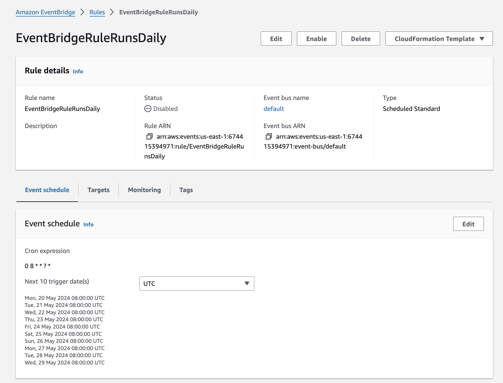

6. Add the EventBridge Rule as the Lmabda trigger.
    1. Go to AWS Lambda, click "Functions", and find out the lambda named as: **DailyLambdaFunctionCheckChangeCalendarState**
    2. Go into the lambda function, click "Add trigger" button, and search "EventBridge (CloudWatch Events)".
    3. Search the execution rule: **EventBridgeRuleRunsDaily**. then click "Add".
Looks like below: 
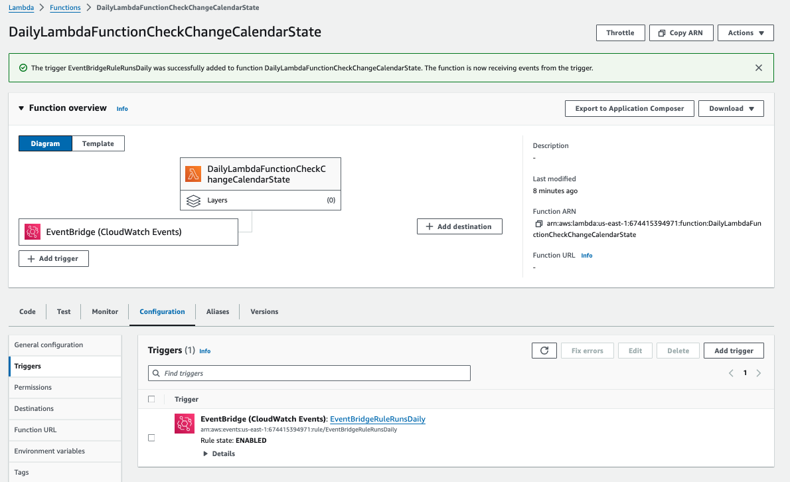

7. Create the Change Calendar with DEFAULT_OPEN.
    1. Open the AWS console, go to AWS Systems Managar.
    2. Click Change Calendar under the Change Management on the left navigator.
    3. Click "Create calendar", and fill out the fields following the screenshot as example. (**example named as: Holiday_Calendar**)
    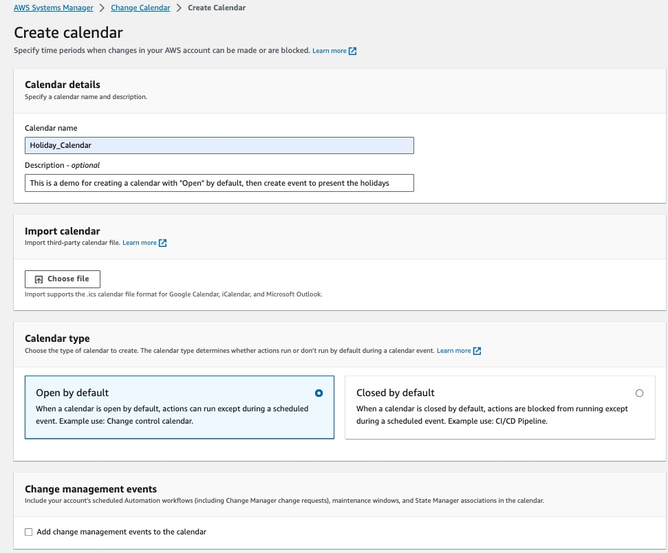
    
    (Note: the change calender default should be OPEN, until the events be created, which events have CLOSED state in detail)
    
    4. Once the calendar has been created, open the calendar and select Details, check the **Calendar use** as below screenshot
    
    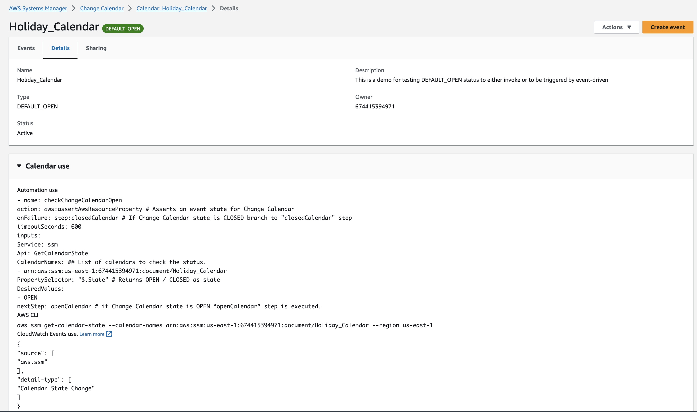

    Explanation: 
    1. Service is SSM (Systems Managr)
    2. Api: GetCalendarState - check the calendar state. _later you will see the creating a role to allow lambda to get the GetCalendarState_
    ```text
    Automation use
    - name: checkChangeCalendarOpen
    action: aws:assertAwsResourceProperty # Asserts an event state for Change Calendar
    onFailure: step:closedCalendar # If Change Calendar state is CLOSED branch to "closedCalendar" step
    timeoutSeconds: 600
    inputs:
    Service: ssm
    Api: GetCalendarState
    CalendarNames: ## List of calendars to check the status.
    - arn:aws:ssm:us-east-1:674415394971:document/Holiday_Calendar
    PropertySelector: "$.State" # Returns OPEN / CLOSED as state
    DesiredValues:
    - OPEN
    nextStep: openCalendar # if Change Calendar state is OPEN “openCalendar” step is executed.
    AWS CLI
    aws ssm get-calendar-state --calendar-names arn:aws:ssm:us-east-1:674415394971:document/Holiday_Calendar --region us-east-1
    CloudWatch Events use. Learn more 
    {
        "source": [
            "aws.ssm"
        ],
        "detail-type": [
            "Calendar State Change"
        ]
    }
    ```
    5. Create events(**example named as: Today_is_Holiday_Test**) - Go to Events tab, and click "Create event".

    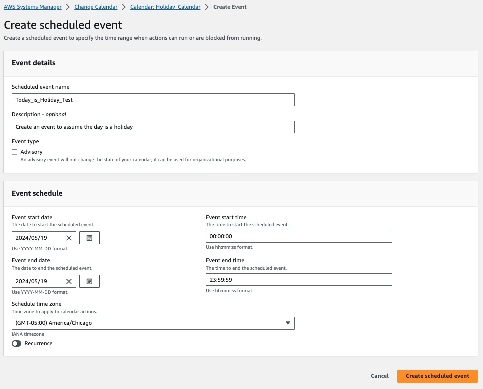<br/>
    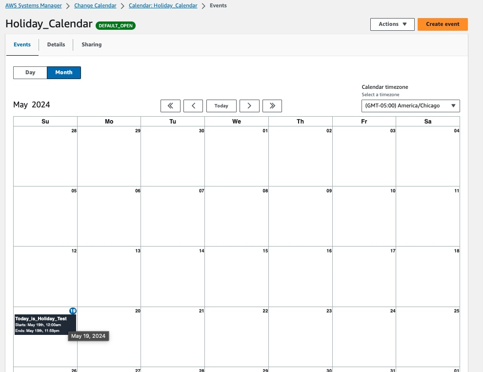


# Change Calender Triggers EventBridge to invoke downstream Lambda

## Overview
1. Create a Systems Manager Change Calender: define your calendar events
2. Create an EventBridge Rule: Triggered by the change Calendar Evetns,
3. Create a Lambda function: Triggered by EventBridge only when the calendar is OPEN
4. Configure IAM Roles: Ensure proper permissions for all services. 


